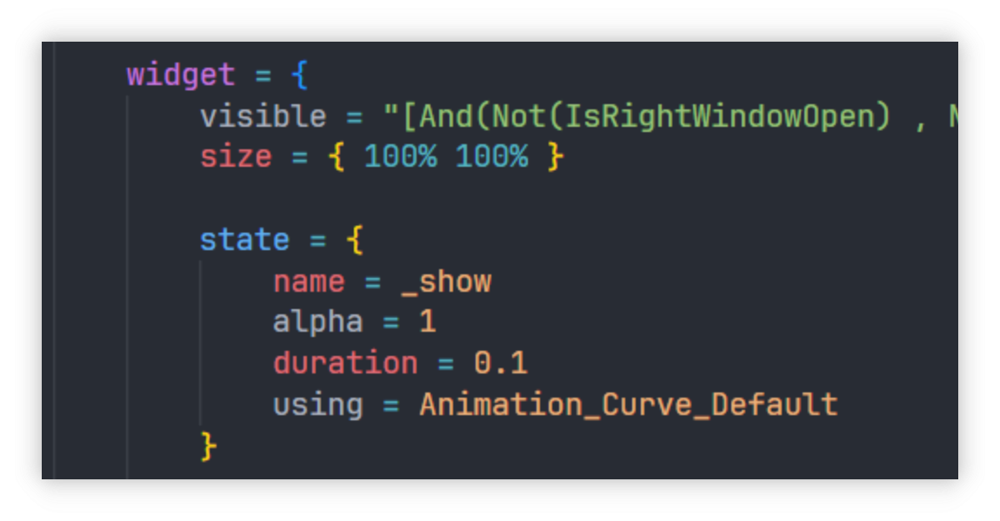

# one-dark-paradox-theme README

A VSCode color theme adapted to Paradox game modding.

## How to use this theme.

Please pre-install the following extensions:

* CWTools - Paradox Language Services
* Paradox Syntax Highlighting

Then switch the color theme to "One Dark Paradox Theme"

**Enjoy!**

## Preview

